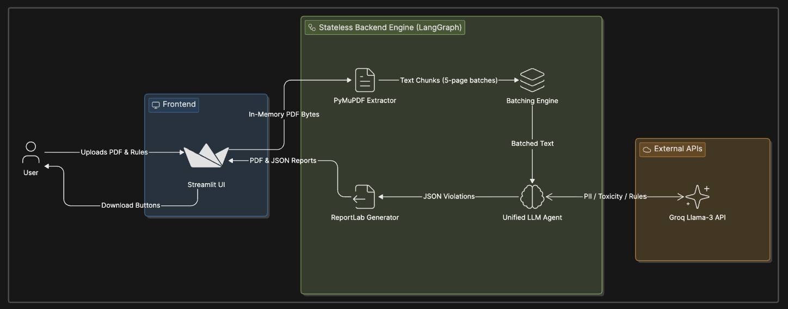

# 📄 AI-Powered PDF Compliance Scanner

A blazingly fast, fully stateless, AI-driven compliance engine built to autonomously scan PDF documents for sensitive data, toxicity, and custom policy violations.

## 🚀 Features

- **100% Stateless Architecture**: No documents or parsed text are ever saved to disk. Uploads, analysis, and report generation occur entirely in memory, making it highly secure and natively safe for concurrent multi-user cloud deployments (like Render or Vercel).
- **Unified Mega-Agent**: Powered by LangGraph and LangChain, the backend utilizes a single highly optimized "Mega-Prompt" via Groq (Llama-3.3-70b-versatile) to simultaneously evaluate multiple compliance domains:
  - **PII Detection**: SSNs, Emails, Phone Numbers, Credit Cards.
  - **Confidentiality**: Trade secrets, proprietary flags, and unreleased financials.
  - **Toxicity**: Hate speech and unlawful language.
  - **Custom Rules**: Your own company-specific guidelines.
- **Smart Page Batching**: Slashes LLM API costs by 95% by grouping and processing 5 PDF pages per batch using visual text markers.
- **Beautiful PDF Reporting**: Generates a visually stunning, downloadable PDF report via `ReportLab` complete with metadata, a grey summary tally, and color-coded tables grouping violations by Severity (Critical, High, Medium, Low).
- **Interactive Rules Engine**: A sleek Streamlit UI allows you to add, edit, and toggle custom rules on the fly, including explicit Target Severity overrides. 

## 🏗️ Architecture Stack

- **Frontend**: Streamlit
- **Agent Orchestration**: LangGraph
- **LLM Integration**: LangChain & ChatGroq (`llama-3.3-70b-versatile`)
- **PDF Extraction**: PyMuPDF (`fitz`)
- **Report Generation**: ReportLab

## 📸 Architecture Diagram



## 🛠️ Local Installation

1. **Clone the repository:**
   ```bash
   git clone https://github.com/your-username/ai-pdf-compliance.git
   cd ai-pdf-compliance
   ```

2. **Create a virtual environment:**
   ```bash
   python -m venv venv
   source venv/bin/activate  # On Windows use `venv\Scripts\activate`
   ```

3. **Install dependencies:**
   ```bash
   pip install -r requirements.txt
   ```

4. **Set Environment Variables:**
   Create a `.env` file in the root directory and add your Groq API key:
   ```env
   GROQ_API_KEY=your_groq_api_key_here
   ```

5. **Run the Application:**
   ```bash
   python -m streamlit run app/ui/main.py
   ```

## 🔒 Security & Privacy
This application does not persist data. When a user closes their browser tab, their session state (including custom rules) vanishes. Uploaded PDFs are instantly converted to byte streams and destroyed from memory the moment the response is dispatched.

---
*Built with LangGraph, Streamlit, and Groq.*
